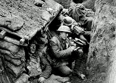
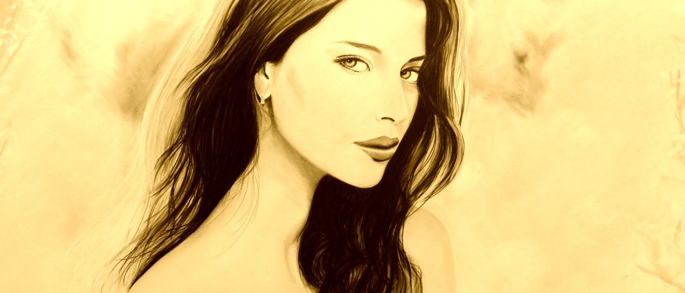

= Реинкарнация

image::0.jpg[800]

На востоке люди верят, что человек проживает не одну, а несколько жизней. Прошлые жизни и события, пережитые в них, оказывают влияние на то, каким человек будет в текущей. Рождаясь на Земле, человек забывает прошлые воплощения, но накопленный опыт, сохраняется. Этим объясняются различные таланты и врожденные качества. Но сохраняется не только хорошее. Сильные эмоциональные переживания, душевная боль, тоже накладывают опечаток на жизнь человека в следующих воплощениях.

== I жизнь
Женщина. Лежит на полу. В неярком свете от окна видны очертания ее совершенной фигуры, длинные темные волосы, платье. Она мертва.

Мужчина. На коленях сидит рядом. Он смотрит на нее застывшим взглядом. В его глазах пустота. Холод разливается внутри. Она мертва. Он - не согласен. Боль, отчаяние, сожаление, бессмысленность дальнейшей жизни. Поднимается ненависть: "Тот из-за кого она погибла – должен умереть".

***

Маленькая комната с низким потолком, тусклым светом. Он сидит, положив локти на стол, смотрит в одну точку. Прошел день? Месяц? Год? Он не ощущал времени. Его сознание застыло в безысходности и отчаянии: "Больше нечего делать в обществе людей, в дальнейшей жизни нет смысла, ее больше нет. Другой такой не будет…"

***

Он идет через город сквозь толпу людей, с холодной, мрачной решимостью, люди чувствуют ее и расступаются.
Есть только одно дело – найти его.
Есть только одно желание – убивать.
Есть только одна чувство – ненависть.
Есть только один цвет – серый.
Других цветов в мире нет.

***

Капли пота стекают по лицу, напряженные мускулы затягивают веревку. Борьба окончена. Врагу больше никуда не деться. Убивать. Убивать медленно, отрезая маленькие кусочки.

Безумная жестокость, это не наслаждение убийством, но невозможно оторваться. Липкая кровь течет по его рукам. Злобный смех доносится до улицы. Блеск ножа исчезает в крови. Он заживо выдирает кишки и наматывает их на руки. То, что он делал с ним дальше, никто не узнает…

***

Убийство не принесло облегчения. Лишь превратило холодную ненависть в яркое пламя. Убивать. Убивать всех иных прочих.

Солнце почти скрылось за горизонтом, трава чуть заметно колыхалась от слабого ветра… Отряд охранников спешивших на крики приближался. Ему не нужно было поворачиваться, чтобы узнать, сколько их и как далеко они. Он чувствовал их внутренним взором.

image::1.jpg[800]

Безошибочно движение, удар, один меч вошел в горло. Первый убит. Вторым мечом отбил атаку и ушел в сторону. Нечего терять. Незачем жить. Нечего боятся. Не о чем думать.

Нет ничего кроме тотальной ярости и тотального желания убивать. Убивать быстро, не думая о цели, о смысле, о последствиях. Пылающий гнев объял все внутри. Два меча, сознание и тело стали едины. Он не чувствовал усталости. Каждый взмах меча поражал цель. Охранники один за другим падали на землю.

Миямото Мусаси, если бы присутствовал там, то c уважением бы посмотрел на его мастерство владения мечом. И все-таки он был всего лишь человеком. А их было слишком много. Он не чувствовал боли, когда его несколько раз протыкали мечом. Истекая кровью, он продолжал убивать, убивать, убивать.

Но сильный дождь не может идти долго. Такая ярость, тоже не может длиться бесконечно. Он догорал. Силы покидали его.

Последнее усилие, последние удары – этих двоих он взял с собой в загробный мир. Пропустил удар в спину. Боли не было, просто что-то холодное прошло через грудь. Затем еще раз. Дыхание остановилось. Тело парализовало, больше не слушало его, опустилось на колени, пошатнулось и упало на землю. И все? Конец? Ему было безразлично.

Может быть, смерть даст покой?

== II жизнь

Когда в 1941 году началась война, он сразу понял, что хочет на фронт. Пришел на призывной пункт. Защищать Родину? Нет. Семью? У него не было семьи, и никогда не хотелось. Он вырос в дет. доме. Не разделял идеи фашизма? За коммунизм? Нет, все это безразлично. Как и сама жизнь. Череда бессмысленных серых дней, ничего не радует, ничего не хочется, даже друзей никаких нет. А война… Война кажется притягательной… волнующей. Как будто в ней есть тайна. Как будто в войне есть смысл.

***

Война стала ему родным домом. Домом, которого у него никогда не было. Здесь все просто и понятно. Есть свои, есть чужие. Своим надо помогать, а врагов надо убивать. Не нужно ни о чем думать. В бою можно забыться. Не чувствовать этой непонятно тоски, безысходности, просто убивать. И это у него хорошо получалось.

***

Серое дождливое небо над головой. Холодная, сырая земля. Горящий танк справа, недалеко от окопа. Тяжесть винтовки в руках. Смешанные ощущения холода и голода, душевной пустоты, пылающего гнева и всеобъемлющего желания убивать. Убивать всех иных прочих.

Внезапная пулеметная очередь прошла по краю окопа, рикошетом выбрасывая мелкие кусочки земли в лицо. Несколько пуль прошли через грудь, отбросив тело на спину, к задней стенке окопа. Пламя гнева оборвалось, исчезло, оставив лишь холод, пустоту, и бессмысленность. Он встретил смерть с равнодушием.

Даст ли она покой?

== III жизнь

В школе он был довольно замкнутым. Труднее, чем другим, давалось общение с одноклассниками. А еще оказалось, совершенно не мог постоять за себя. Он начал заниматься каратэ, чтобы научиться давать отпор обидчикам. Делал успехи, но только если это бой в зале, если он был не по-настоящему. Нет, он не боялся противника. Просто руки немели и отказывались двигаться. Терпел унижения одноклассников и не мог ответить.

В 13 лет, когда мальчики начинают интересоваться девочками, он встретился с проблемой. Совершенно не мог общаться с девчонками. Страшно. Очень, очень страшно. В итоге, находил убежище в компьютерных играх.

Когда исполнилось 16 лет, накрыло вопросом: "А зачем я живу? В чем смысл моей жизни "? Всем приходит в голову этот вопрос. Но ему он не давал покоя, жизнь казалось пустой и бессмысленной. Вся последующие годы стали поиском, попыткой найти ответ.

Он искал ответов в философии. В книгах и мнениях ученых. Пытался забыться в развлечениях, студенческих пьянках, в приключениях и адреналине. В разнообразных хобби: шахматы, химия, эксперименты с взрывчатыми веществами и электродетонатором, гонки на лыжах и велосипеде, пешие походы, альпинизм, стрельба из лука, верховая езда. Все приедалось. Ничто не могло заполнить эту внутреннюю пустоту.

Однажды, бросил институт и без денег уехал автостопом в Сибирь, собираясь шататься по миру в поисках себя, в поисках смысла. Романтика длинных дорог так же наскучила через полгода. Разочаровавшись в идее бесконечного путешествия, он подался на дно социума. Но проститутки, наркотики и бродяжничество лишь усилили отчаяние.

Потом были попытки разбогатеть, десяток провалов и потерь денег, пара удачных проектов, три мебельных магазина. Драйв и суета бизнеса временами отвлекали от душевных страданий. Потом была идея сделать что-то хорошее, полезное для мира. Он создал экологическое сообщество, сажали деревья в пригородном лесопарке. Организовал крупную уборку леса, с раздельным сбором мусора. Работа на благо общества, сознание того, что после него что-то останется, приносили вдохновение, но лишь в короткие минуты успеха. Пустота всегда возвращалась.

С годами отчужденность только усиливалась. Все чаще хотелось напиться и уйти от этой невыносимой серости, бессмысленной суеты, бесполезных усилий. Все реже бывали периоды вдохновения, драйва, азарта, амбициозных планов и целеустремленной работы. И отношения с девушками так же не складывались. И никак не удавалось, побороть свой страх.

Будто серая пелена перед глазами все больше отделяла его от жизни. А еще эта странная, необъяснимая, притягательность маленьких комнат. Он мог часами сидеть не подвижно, положив руки на стол, глядя в одну точку. Ему было непонятно, почему люди боятся одиночества. Почему ищут компании и развлечений. Ему было непонятно…

А однажды ему повезло. Он встретил красивую девушку, такие обычно не обращали на него внимания. У нее были длинные темные волосы и совершенная фигура. Впервые обняв ее, он испытал самое сильное, самое лучшее переживание в жизни. В тот момент он решил: "Я тебя никогда не оставлю, никогда".

Каждая встреча была эйфорией. Мысли о ней озаряли его жизнь. И некоторое время все было хорошо. Он думал, что обрел счастье и покой. С ней, не нужен был никакой дополнительный смысл. Ее было достаточно. Они гуляли, говорили до утра, пили чай, подолгу смотрели в глаза, смеялись, молчали, занимались любовью. Он строил мечты совместной жизни. Жизни, которая не случилась. Она внезапно ушла. Не объясняя причин, не давая шансов. Просто сказала: "Не хочу".

Его страдания были так велики, как только могут быть велики страдания человека. Днем он едва справлялся со своими обязательствами в мебельном бизнесе, постоянно думал о ней. Вечерами пил, курил сигареты одну за другой, сидя в комнате на полу. Временами из глаз текли слезы, так, сами по себе. Пустота. Безысходность. "Больше нечего делать в обществе людей, в дальнейшей жизни нет смысла, ее больше нет. Другой такой не будет… "

Один знакомый спросил как то раз: "Не хочешь на войну, в Сирию?". Этот вопрос вызвал какой-то странный и мощный отклик внутри. Он и раньше думал о войне. Думал стать наемником, там можно будет убивать и насиловать всех иных прочих. Почему-то война казалась привлекательной. Все равно нечего терять, незачем жить. Он отгонял эти мысли. Пусть он сам не находил смысла и счастья, но причинять страдания другим он не хотел.

Найдет ли он покой?

***

"Пусть все живые существа наслаждаются счастьем и причинами счастья.
Пусть все живые существа будут свободны от страданий и причин страданий".

Alex Avin
Москва, 2018.10.29
